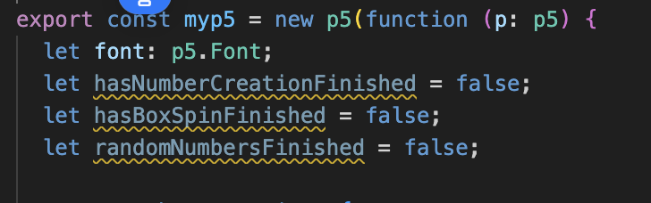
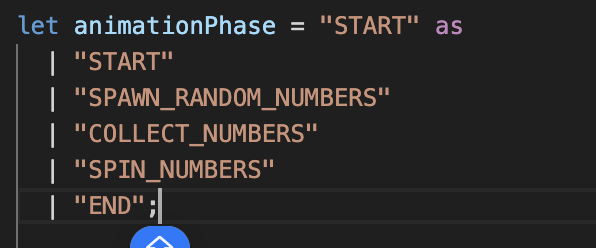
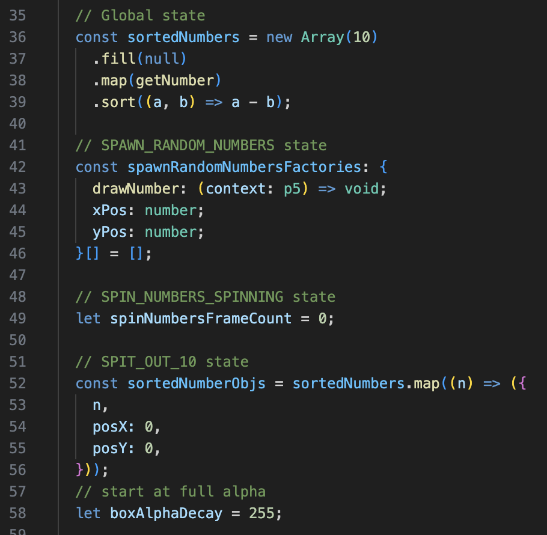

---js
const title="Recurse: W1D3"
const date="2025-02-19"
const tags="recurse"
---

# Recurse center: W1D3

Some things I did and worked on at the Hub:

1. Commuted downtown by bike (UWS -> Downtown Brooklyn)
1. Went a couple lessons into [The last algorithms course you'll need](https://frontendmasters.com/courses/algorithms/), practiced some binary search
1. Realized I needed some extra practice on groking binary search, decided to try some animating
1. Went with p5.js, since it's a good starting point for the skills I have
    - Realized that the [p5.js](https://editor.p5js.org/) editor is cool, but lacks type-checking that I am used to at this point
    - [the types package](https://www.npmjs.com/package/@types/p5) exists, and next steps was to get it working in a nice hot-reloading environment
    - Success! Here's [my project](https://github.com/etgrieco/recurse-binary-search-p5) setting up the animation in p5
        - Maybe turn it into a template repository? 🤔
1. Ended the day with listening to some 'non-programming presentations' at the Recurse center, where I heard people present about biking across New Zealand, [eating lightbulbs](https://youtu.be/ECoWZtFO-pU?si=P_KvVAKIDMrppXLs&t=55), role-play STEM education, and how to [fairly cut a cake](https://www.youtube.com/watch?v=fvM8ow6zNw4) -- or any kind of divisible resource -- fairly.

## Working on the P5.js animation

Animation and graphical work is pretty new to me. 

Here's what I got done for the animation so far:

    W1D3 progress on a binary search illustration

<video controls width="640" height="360" aria-describedby="binary-search-progress-video-desc">
    <source src="/blog-assets/recurse-w1d3/end-of-w1d3-binary-search-progress.mp4" type="video/mp4">
</video>

([commit](https://github.com/etgrieco/recurse-binary-search-p5/tree/3829817bfb805ed59d01263369c2770fb564c3d9))

As I was going through:

I realized that it was superior to structure my code in a (very light)'state-machine' pattern

*Before*

</img>

*After*

</img>

And while I *could* do some work to tightly couple these state enums to the data pieces that are relevant just to that 'scene', for now I just used comments to organize it: ([see lines](https://github.com/etgrieco/recurse-binary-search-p5/blob/3829817bfb805ed59d01263369c2770fb564c3d9/src/main.ts#L35-L58))

</img>

Finally, the usefulness of this state technique definitely came to life when I could easy 'jump scenes' in order to debug and tweak certain parts of my animation. This combined very well with the TypeScript + hot-reloading setup:

TypeScript + hot-reloading setup so that I can quickly iterate on visual tweaks to the animation

<video controls width="640" height="360" aria-describedby="hot-reload-video-desc">
    <source src="/blog-assets/recurse-w1d3/example-hot-reload-and-tweak-in-animation-scene.mp4" type="video/mp4">
</video>

And that's definitely something I always value -- put in a little bit of effort for the most useful kind of fast-feedback possible:
- Fast code feedback via TypeScript; fail at compilation, not runtime!
- Fast visual feedback via hot-reloading

Some hopes for tomorrow:
- Improve (finish?) the animation to show how binary search works -- [something like this page](https://www.cs.usfca.edu/~galles/visualization/Search.html), but with my own twist
- Consider if its worth to publish a basic vite + p5.js setup, since I came up with my own 'flavor' of getting the beginning working (this [blogpost](https://dev.to/tendonnman/how-to-use-p5js-with-typescript-and-webpack-57ae) for webpack got me started, with some adjustments)