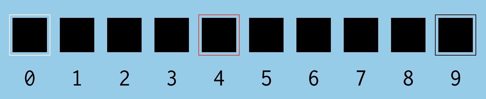
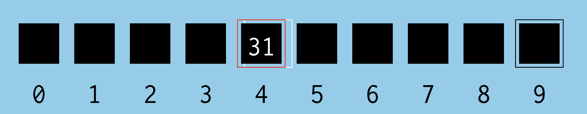

---js
const title="Recurse: W1D4-5"
const date="2025-02-22"
const tags="recurse"
---

# Recurse center: W1D4 & W1D5

## W1D4

Today was a lot more socially oriented; some things I talked about were [React Three Fiber](https://r3f.docs.pmnd.rs/getting-started/introduction) and the current [Lyft/Citibike relationship](https://help.citibikenyc.com/hc/en-us/articles/360032341451-Ride-Citi-Bike-with-Lyft) and other things about biking history in NY.

I put about an hour improving upon the animation from [the day before]("../recurse-w1d3.md"), then it was time for a series of technical presentations. Here, other folks from Recurse reflected on things they were working on. I saw someone else building mathematically-driven animations in [P5.js](https://p5js.org/), (demo-able [here](https://codepen.io/rwhaling/pen/yyLONeY) and [here](https://codepen.io/rwhaling/pen/MYWywyK)); it was very cool to see all the fun ways the library could be applied and implemented.

## W1D5

## Working on and "completing" the p5.js animation - binary sort

Today, I was able to be a bit more heads-down to get some traction on getting to a satisfying 'completion' point on the binary search animation. As things entered the later "scenes", code organization and state management was getting *very* messy very fast.

Here is the [end-state file](https://github.com/etgrieco/recurse-binary-search-p5/blob/main/src/main.ts) -- ~800 lines of typescript 😂

## The animation - what went well

The goal here was to make an animation that could sensibly demonstrate how binary sort works. The final product is viewable [at this page.](https://websiteaboutmy.website/recurse-binary-search-p5/). 

Instead of being a static animation, we are computing and rendering everything in real-time. It is not interactive, but it is slightly more programmatically made than a rendered animation.

1. Picks 10 random numbers
2. Sorts them
3. Randomly selects one of the 10 numbers.
4. Demonstrates how binary search works by working through the algorithm.

Most of the animation is in 2d, but I did chose the [WEBGL rendering mode](https://p5js.org/reference/p5/WEBGL/). This enables some three dimensional features, and in the animation itself you can even click and drag around to move the 3-D camera around the animation while it is playing.

## So, what went wrong?

For this exercise, being fast-and loose was in many ways the point here. I wanted to see where things get messy, when it makes sense to modularize, and logically how I should be dividing my animation's "state management" work between the state that lives in 'objects' vs the state that lives in 'scenes'.

Let's consider this, [one of 10,000 failed attempts](https://www.oxfordreference.com/display/10.1093/acref/9780191826719.001.0001/q-oro-ed4-00003960#:~:text=Thomas%20Alva%20Edison%201847%E2%80%931931&text=I%20have%20not%20failed.,ways%20that%20won't%20work.&text=Waste%20is%20worse%20than%20loss.) to manage state for a long-running animation. 💀 .

### Some lessons

*Don't assume a single source of truth for all data*

In writing apps for the web, a golden rule is typically 'unify your single source of truth'. Having duplicate versions of what is ultimately the same state is bad. This is so that if you ever have multiple parts of the app reflecting the same sort of data, you make sure they all stay in sync.  Wherever there needs to be *derived* state from this data, it is important that we don't simply hold that in another part of state, but instead 'derive it'.

For example, let's say we have incoming messages as part of our app. Let's say we have aa global data store holding our data.

Nearly all developers would say keep your store looking like this:

```
{
    messages: [
        {
            id: 1,
            content: 'Hello, there!',
            readStatus: true,
            timeStamp: '2025-02-23T00:24:54.661Z',
            senderId: 1234
        },
        {
            id: 2,
            content: 'Hi again!',
            readStatus: true,
            timeStamp: '2025-02-23T00:24:55.661Z',
            senderId: 1234
        },
        {
            id: 3,
            content: 'You there?',
            readStatus: true,
            timeStamp: '2025-02-23T00:24:56.661Z',
            senderId: 1234
        },
    ],
    lastReadMessageId: 1,
    senders: [ ... ]
}
```

And we'd want to avoid adding any additional 'redundant' data fields that our client would be responsible for managing, for example:

```
// managing this as updatable, independently maintained client state is considered poor form
{
    unreadMessageCount: 2,
    lastMessageReadId: 2,
    highestPrioritySender: 1234
}
```

The reason this is considered 'poor form' is that by managing these values manually, we risk 'de-syncing' our state over time. That is, you just got a new message. Did you remember to increment your `unreadMessageCount`? Has your determination for the `highestPrioritySender` changed? Where in your visual tree does the responsibility lie? What do we do if the 'derived' state of `messages` conflicts with the 'synchronized' state of `unreadMessageCount`?

However, in animation, my intuitions about what is 'derived' versus 'maintained' client state are not as clear cut.

Take this part of the animation for example:

<p id="binary-search-multiple-numbers-example-desc" class="visually-hidden">
    Example animation where multiple numbers are simultaneously displayed. One fades in while the other fades out.
</p>
<video controls height="360" aria-describedby="binary-search-multiple-numbers-example-desc">
    <source src="/blog-assets/recurse-w1d4-5/animation-example-multiple-numbers.mp4" type="video/mp4">
</video>

Because our `draw` loop is running continuously, for all frames in-between drawing each number, we have to be responsible for preserving the state of both the *ingoing* and *outgoing* numbers

```ts
const textHighLowMid = {
high: {
    in: "",
    out: "",
},
low: {
    in: "",
    out: "",
},
mid: {
    in: "",
    out: "",
},
} satisfies Record<string, { in: string; out: string }>;
```

And then on top of this, the places to maintain where the current *actual* state of our algorithm (as-is running under the hood) is also being maintained on their own as numbers

```ts
const binarySearchState = {
    low: 0,
    high: 0,
    mid: 0,
};
```

The challenge here becomes keeping all of these sources of truth in sync over time, and making sure that I am doing those at the correct 'points' in the animation. 

I can already see how this challenge would carry over to game development. The 'simulation state' of what is happening and the 'animation state' of the same are connected, yet discrete concepts. 

Here are some ways I could imagine it playing out in a game; let's say that in a space invaders game, an enemy dies, but it takes about one second of animation for the spaceship death to animate.

Over time, we cannot simply rely on one state variable:
```
{
    isDead: true
}
```

But perhaps multiple

```
{
    isDead: true
    deathTime: '2025-02-23T00:24:56.661Z',
    isCollisionActive: true 
}
```

and all of these data points can have different significances to the game logic depending on the game rules being implemented.

For example, while the ship is dead, do we consider it still an entity that can 'stop' bullets while the ship destruction animation is active?

Getting these techniques right is definitely something I'm not sure about, but a wrong way I did learn was keeping these states in two different containers, and arbitrarily 'updating' these over time as I worked through the logic and animation of the scene.

There's probably something here to keep in mind about keeping 'animation state' and 'simulation state' separated from each other; they must run over the same timeline, and clearly the way an animation state must update *depends* upon the 'simulation state', but the logical machine that couples these two state containers also needs its own rules, and being able to follow and update those rules apart from the simulation/animation states themselves becomes really important for an animation that we want to tweak over time.

**Definitions are hard**

Let's take a look at the animation in the current snapshot.



When I got to this stage of writing the animation, I was tasked with coming up with how to draw the 'outlines' per box.

At first, I had a function that basically looked like this.

```
function drawBoxWithOutlines(posX, posY, outlineColor) {
    // draw the box with the outline....
}
```

But then, I had the fun idea that these outlines should 'move' to demonstrate what to be done when a variable tracking our high, mid, and low values were to change



Oh dear -- `drawBoxWithOutlines` is not the correct abstraction at all! The outlines and boxes are actually to be drawn completely separate from each other. Instead, what we care about is maintaining the current position of the boxes and their outlines independently; then, over time we have to transition from its current location to its new location:

```ts
let movingObj: { posX: number } | undefined;
let targetObj: { posX: number } | undefined;
if (midObj.n > needleToFind) {
    binarySearchState.high = binarySearchState.mid - 1;
    // move the outline
    targetObj = sortedNumberObjs[binarySearchState.high];
    movingObj = outlineObjs.high;
    movingObj.posX = p.lerp(movingObj.posX, targetObj.posX, 0.05);
} else if (midObj.n < needleToFind) {
    binarySearchState.low = binarySearchState.mid + 1;
    // move the outline
    targetObj = sortedNumberObjs[binarySearchState.low];
    movingObj = outlineObjs.low;
    movingObj.posX = p.lerp(movingObj.posX, targetObj.posX, 0.05);
} else if (midObj.n === needleToFind) {
    window.alert("found it!"); // deal with this later
    animationPhase = "END";
    return;
}
```

Certainly not the prettiest code as-is, but it got the job done for what I needed.

In this case, our `movingObj` was tracking our `outline` object position state, whereas `targetObj` was a reference to the box object it was moving towards.

We then put some basic end-conditions to understand when it is appropriate to advance to the next phase

```ts
if (isBasicallyEqual(targetObj.posX, movingObj.posX)) {
    // transition to the next animation sequence
}
```

Here I think the take-home lesson is -- double check your assumptions about what objects are necessarily grouped with what. Is this a "box with an outline" or a "box" and an "outline"?

Anyway, I'm happy with this amount of reflection.

We'll see if it helps for future work!

